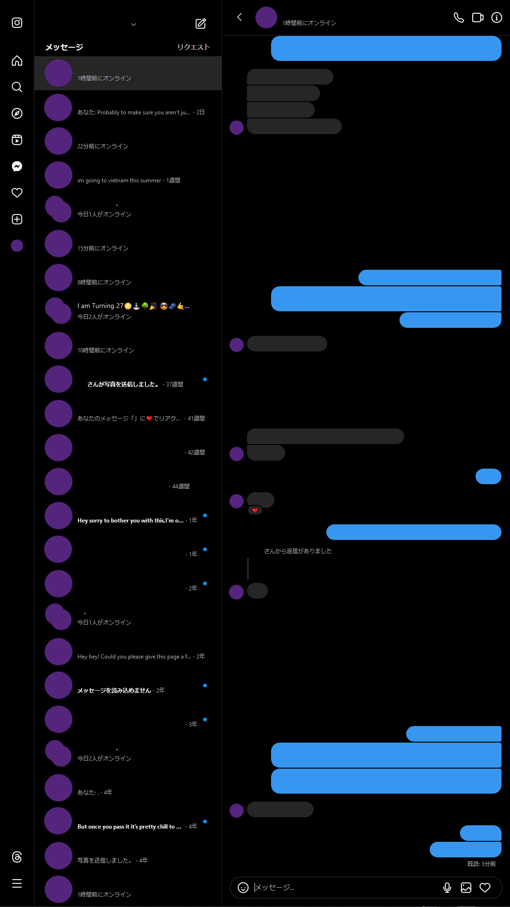
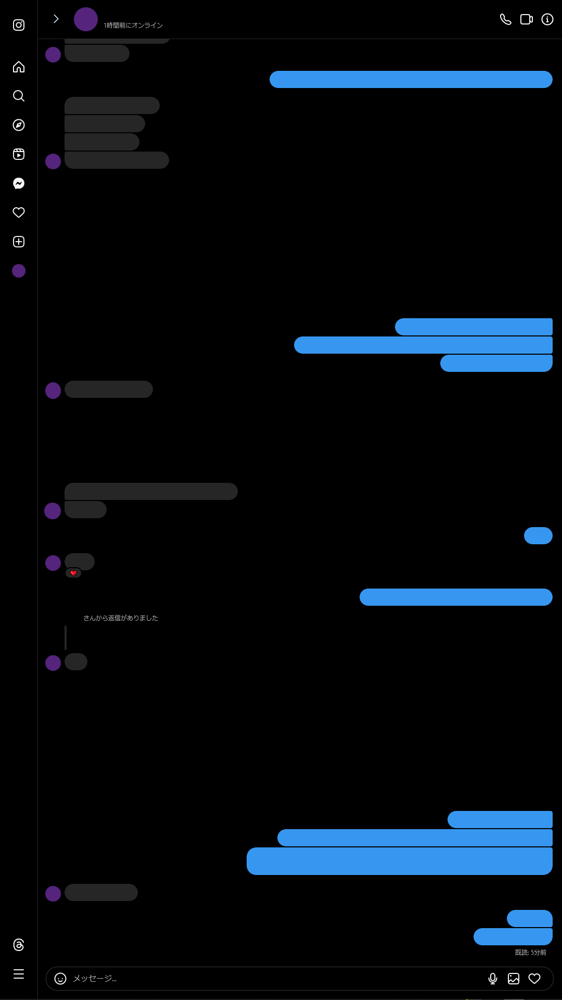

# Instagram Message List Toggle
This [ViolentMonkey](https://violentmonkey.github.io/) script adds an arrow to the header of a conversation on Instagram to allow you to toggle visibility of the message list on the left-hand side. This is useful for vertical screen orientations as there is often not enough space left to read messages.

